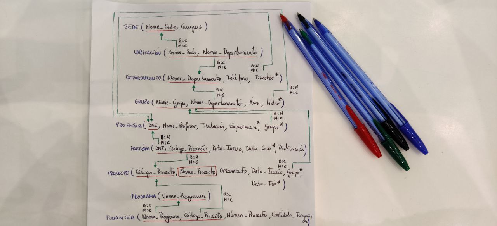

# Apuntes DDL

DDL es un sublenguaje de SQL que nos permite definir las estructuras que almacenaran los datos de la base de datos.

## SENTENCIAS

* **CREATE**, permite crear la base datos, tablas, vistas, etc.

* **ALTER** permite modificar la estructura de una tabla.

* **DROP** permite eliminar una estructura, es decir una tabla, la base de datos, etc.

###  CREATE
La sintaxis para crear una base de datos es la siguiente:
```sql
CREATE (DATABASE|SCHEMA)
[IF NOT EXIST] nameDB
[CHARACTER SET CharsetName]
```
* Podemos utilizar tanto **DATABASE** como **SCHEMA** como sinónimos
* **IF NOT EXIST** es opcional y se utiliza para que en caso de ya existir la tabla no crearla.
* EL **CHARSET SET** también es opcional y nos permite cambiar el tipo de caracteres admitidos.
La sintaxis para crear una tabla es la siguiente
```sql
CREATE TABLE "nombre_tabla"
("columna 1" "tipo_de_datos_para_columna_1",
"columna 2" "tipo_de_datos_para_columna_2",
... );
```

### ALTER
La sintaxis de **ALTER** para añadir o eliminar columnas es la siguiente:
```sql
ALTER TABLE table_name
ADD column_name datatype,
DROP column_name [CASCADE|RESTRICT];
```
* Con **ADD** añadimos columnas y con **DROP** las eliminamos, también es necesario indicar el tipo de dato.
* Al eliminar la columna podemos eliminarla en cascada (**CASCADE**), es decir eliminara todas las estructuras que dependan de la columna, con **restrict**  no eliminaremos la columna si existe una o mas estructura que dependan de ella.

También podemos utilizar **ALTER** para modificar una columna:
```sql
ALTER TABLE table_name
ALTER COLUMN column_name datatype;
```
### DROP
De igual manera que con **CREATE** y **DROP** podemos eliminar tanto la base de datos como una tabla.

Para eliminar la base de datos la sintaxis es:
```sql
DROP SCHEMA
[IF EXISTS] <Nombre-de-la-base-de-datos>
[CASCADE|RESTRICT];
```
* **CASCADE** borra la base de datos aunque tenga datos
* **RESTRICT** protege la base datos si no está vacía.

Para eliminar una tabla:
```sql
DROP TABLE
[IF EXISTS] <Nombre-de-la-tabla>
[CASCADE|RESTRICT];
```

## CONSTRAINTS
Un constraint es una restriccion que permite limitar el tipo de dato que puede ingresarse en una tabla. 

Se pueden utilizar con la instrucción **CREATE TABLE** y con **ALTER TABLE**

Tipos de **constraints**:

* **PRIMARY KEY**
* **FOREIGN KEY**
* **NOT NULL**
* **UNIQUE**
* **CHECK**

### PRIMARY KEY

La sintaxis es la siguiente:
```sql
[CONSTRAINT <nombre-de-la-restricción>]
PRIMARY KEY (<atributo>);
```
* **CONSTRAINT** es opcional y sirve para darle un nombre al constraint.
* Dentro de **PRIMARY KEY** por mas de un atributo por tanto podemos poner mas de un atributo dentro del paréntesis separados por comas.
* También se puede utilizar el constraint **PRIMARY KEY** colocándolo simplemente detrás del atributo que va a ser clave principal como en el siguiente ejemplo:
```sql
CREATE TABLE Sede (
  Nome_Sede CHAR(10) PRIMARY KEY,
  Campus CHAR(10),
);
```
* Sin embargo esto **solo lo podemos hacer si la clave principal está formada por un solo atributo**, es decir si está formada por dos atributos tendremos que hacerlo de la forma anterior.

### FOREIGN KEY
Sintaxis:
```sql
[CONSTRAINT <nombre-de-la-restricción>]
FOREIGN KEY (<atributo>)
REFERENCES <nombre-de-la-tabla-referenciada>[(atributos-referenciados)]
[ON DELETE CASCADE|NO ACTION|SET NULL|SET DEFAULT]
[ON CASCADE CASCADE|NO ACTION|SET NULL|SET DEFAULT];
```
Añadimos la FK a un atributo y con **REFERENCES** seleccionamos la tabla de la que viene la clave ajena, opcionalmente podemos indicar el nombre del atributo en la otra tabla en caso de llamarse de forma diferente, en caso de no indicarlo seleccionara la clave principal de la otra tabla.
* **ON DELETE** especifica que hacer cuando los datos principales son borrados.
* **ON UPDATE** especifica que hacer cuando los datos principales son actualizados o modificados
* **CASCADE** los datos se eliminan o actualizan si se modifican en la tabla de la que proviene.
* **NO ACTION** los datos no se eliminan ni modifican si se modifican en la tabla de la que proviene. **Es la opción por defecto si no lo especificamos**.
* **SET NULL** si los datos de la tabla origen son modificados o eliminados se establecen en NULL.
* **SET DEFAULT** si los datos de la tabla origen son modificados o eliminados los datos tomaran los valores predeterminados. Esta opción no es muy utiliza. **OJO por defecto el valor predeterminado es NULL si no especificamos ningún valor predeterminado**.

### NOT NULL
Sirve para que las columnas no acepten valores nulos.

Ejemplo:
```sql
CREATE TABLE Departamento (
  Nome_Departamento CHAR(10) PRIMARY KEY,
  Teléfono CHAR(9) NOT NULL,
;
```
### UNIQUE
Permite agregar a una columna unicidad es decir que no se pueda repetir

Ejemplo:

```sql
CREATE TABLE Departamento (
  Nome_Departamento CHAR(10) NOT NULL UNIQUE,
  Teléfono CHAR(9) NOT NULL;
```
También se puede añadir en un CONSTRAINT:
```sql
CONSTRAINT UQ UNIQUE (Nome_Departamento,Teléfono);
```
* Cuando utilizamos el constraint de **PRIMARY KEY** este atributo es como si fuera **UNIQUE** + **NOT NULL**.

### CHECK
Sirve para limitar el valor que pueden ser utilizados en una columna o en una tabla.

Ejemplos:
```sql
CONSTRAINT CHECK-objetivo-positivo
CHECK objetivo >0
```
```sql
CONSTRAINT CHECK-SUELDO-MÁXIMO-DEPT-A
CHECK sueldo >= (
  SELECT sueldo
  FROM empleado
  WHERE dept ='A');
```

### TIPOS DE DATOS
| Tipo de datos| Descripción                          |
| :-----------:| :----------------------------------- |
| **NUMEROS**  | Descripción                          |
| INTEGER      | número entero                        |
| DECIMAL      | número preciso                       |
| REAL         | número no preciso                    |
| **TEXTO**    | Descripción                          |
| CHAR         | texto de longitud fija               |
| VARCHAR      | texto de longitud variable           |
| TEXT         | texto de longitud ilimitada          |
| **FECHAS**   | Descripción                          |
| DATE         | día, mes, año                        |
| TIME         | hora, minuto, segundo [zona horaria] |
| TIMESTAMP    | DATE+TIME                            |

      
| BOOLEAN      | Valores   |
| -------------| --------- |
| TRUE    | verdadero |
| FALSE   | falso     |
| NULL    | nulo      |

| OTROS |
| ----- |
| MONEY |
| UUID  |
| JSON  |
| XML   |
| CIDR  |
| INET  |

### CREACIÓN DE DOMINIOS
De igual forma que podemos utilizar diferente tipos de datos también podemos crear nosotros otros tipos de datos de forma que si vamos a utilizar ese tipo de forma recurrente podremos declarar los tipos de datos más de forma más rápida y cómoda.

EJEMPLO:
```sql
CREATE DOMAIN Nome_Válido VARCHAR (30);

CREATE TABLE Sede (
  Nome_Sede Nome_Válido PRIMARY KEY,
  Campus Nome_Válido,
);
```
Primero creamos el dominio y a continuación lo utilizamos poniendo el nombre del dominio en el tipo de dato a la hora de crear la tabla o modificarla.

### EJERCICIO EXPLICADO



```sql
CREATE DOMAIN Nome_Válido VARCHAR (30);
CREATE DOMAIN Tipo_Código CHAR (5);
CREATE DOMAIN Tipo_DNI CHAR (9);
```
Creamos los dominios que vamos a utilizar.
```sql
CREATE TABLE Sede (
  Nome_Sede Nome_Válido PRIMARY KEY,
  Campus Nome_Válido,
);
```
Creamos la tabla Sede con dos atributos y un constraint de PRIMARY KEY en este caso como está formada por un solo atributo lo ponemos a continuación del tipo de dato.

```sql
CREATE TABLE Departamento (
  Nome_Departamento Nome_Válido PRIMARY KEY,
  Teléfono CHAR(9) NOT NULL,
  Director Tipo-DNI,
  -- FK Director
);
```
Creamos la tabla Departamento, Nome_Departamento es la clave principal y Teléfono no puede ser nulo. Director es una clave ajena pero no podemos poner el constraint hasta que la tabla de la que viene este creada por eso hemos puesto un comentario para añadirla posteriormente con un ALTER TABLE.

```sql
CREATE TABLE UBICACIÓN (
  Nome_Sede Nome_Válido,
  Nome_Departamento Nome_Válido,
  CONSTRAINT PK_Ubicación
  PRIMARY KEY (Nome_Sede, Nome_Departamento),
  CONSTRAINT FK_Sede
  FOREIGN KEY (Nome_Sede)
  REFERENCES Sede (Nome_Sede)
  ON DELETE CASCADE
  ON UPDATE CASCADE,
   CONSTRAINT FK_Departamento
  FOREIGN KEY (Nome_Departamento)
  REFERENCES Departamento (Nome_Departamento)
  ON DELETE CASCADE
  ON UPDATE CASCADE
);
```
En esta tabla observamos que la **PRIMARY KEY** la añadimos como un constraint mas abajo, esto se debe a que al estar compuesta por dos atributos no se puede hacer de la forma utilizada anteriormente.

También tiene dos atributos que son claves ajenas y se modifican y eliminan ambas en cascada.

```sql
CREATE TABLE GRUPO (
  Nome_Grupo Nome_Válido,
  Nome_Departamento Nome_Válido,
  Área Nome_Válido NOT NULL,
  Líder Tipo_DNI,
  CONSTRAINT PK_GRUPO
  PRIMARY KEY (Nome_Grupo, Nome_Departamento),
  -- FK Profesor
  FOREIGN KEY (Nome_Departamento) REFERENCES Departamento
  ON DELETE CASCADE
  ON UPDATE CASCADE
  
);
```
Añadimos otra tabla y como podemos ver también hemos dejado un comentario porque falta una clave ajena de una tabla que todavía no hemos creado.

```sql
CREATE TABLE Profesor (
  DNI Tipo_DNI PRIMARY KEY,
  Nome_Profesor Nome_Válido NOT NULL,
  Titulación VARCHAR(20) NOT NULL,
  Experiencia Integer,
  N_Grupo Nome_Válido,
  N_Departamento Nome_Válido,
    FOREIGN KEY (N_Grupo, N_Departamento)
    REFERENCES Grupo (Nome_Grupo, Nome_Departamento)
    ON DELETE SET NULL
    ON UPDATE CASCADE
);
```
La clave ajena se borra a nulos es decir si se borra la tabla grupo, entonces en esta tabla N_Grupo y N_Departamento tomarán los valores NULL.

```sql
CREATE TABLE Proxecto (
  Código_Proxecto Tipo_Código PRIMARY KEY,
  Nome_Proxecto Nome_Válido UNIQUE,
  Orzamento MONEY NOT NULL,
  Data_Inicio DATE NOT NULL,
  Data_Fin DATE,
  N_Gr Nome_Válido,
  N_Dep Nome_Válido,
  CONSTRAINT UQ_Proxecto
  UNIQUE (Nome_Proxecto),
  CONSTRAINT Check_Dates
    CHECK (Data_Inicio < Data_Fin),
  CONSTRAINT FK_Grupo_2
    FOREIGN KEY (N_Gr,N_Dep)
    REFERENCES Grupo
    ON DELETE SET NULL
    ON UPDATE CASCADE
    );
```
En esta tabla utilizamos el constraint **UNIQUE** Y EL **CHECK** para que la fecha de inicio no sea posterior a la fecha de fin.

```sql
ALTER TABLE Departamento
  ADD CONSTRAINT FK_Departamento_Profesor 
    FOREIGN KEY(Director) REFERENCES Profesor (DNI)
    ON DELETE SET NULL
    ON UPDATE CASCADE;
```

```sql
ALTER TABLE Grupo
  ADD CONSTRAINT FK_Grupo_Profesor
    FOREIGN KEY (Líder)
    REFERENCES Profesor (DNI)
    ON DELETE SET NULL
    ON UPDATE CASCADE;
```
Con estos dos **ALTER** modificamos las tablas anteriormente creadas en las cuales faltaban claves ajenas ahora que las tablas de las que dependen ya están creadas.

```sql
CREATE TABLE Participa (
DNI Tipo_DNI
Código_Proxecto Tipo_Código
Data_Inicio DATE, NOT NULL
Data_Cese DATE,
Dedicación INTEGER NOT NULL,
PRIMARY KEY (DNI, Código_Proxecto),
CONSTRAINT FK_Participa_Profesor
    FOREIGN KEY DNI
    REFERENCES Profesor (DNI)
    ON DELETE NO ACTION
    ON UPDATE CASCADE,
CONSTRAINT FK_Participa_Proxecto
    FOREIGN KEY Código_Proxecto
    REFERENCES Proxecto (Código_Proxecto)
    ON DELETE NO ACTION
    ON UPDATE CASCADE,
CONSTRAINT CK_Participa
CHECK (Data_Inicio < Data_Cese),
);
```
```sql
CREATE TABLE Programa (
  Nome_Programa_ Nome_Válido PRIMARY KEY);
```

```sql
CREATE TABLE Financia (
Nome_Programa Nome_Válido,
Código_Proxecto Tipo_Código,
Número_Programa Tipo_Código NOT NULL,
Cantidade_Financiada MONEY NOT NULL,
PRIMARY KEY (Nome_Programa, Código_Proxecto)
);
```

```sql
ALTER TABLE Financia
 ADD CONSTRAINT FK_Financia_Programa
 FOREIGN KEY (Nome_Programa) 
 REFERENCES Programa
 ON DELETE CASCADE
 ON UPDATE CASCADE;
);
```

```sql
ALTER TABLE Financia
 ADD CONSTRAINT FK_Financia_Proxecto
 FOREIGN KEY (Código_Proxecto) 
 REFERENCES Proxecto
 ON DELETE CASCADE
 ON UPDATE CASCADE;
```
En este caso añadimos las claves ajenas en un alter para ver que se puede hacer de diferentes formas.