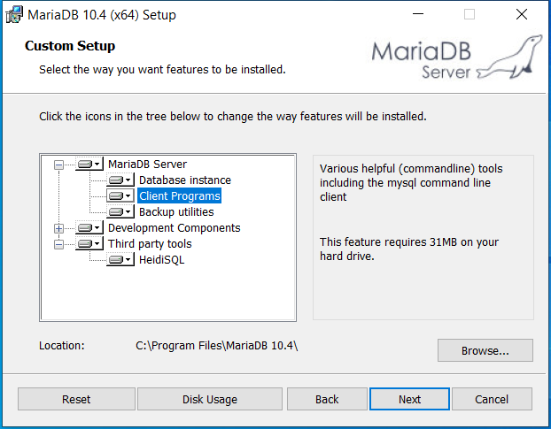
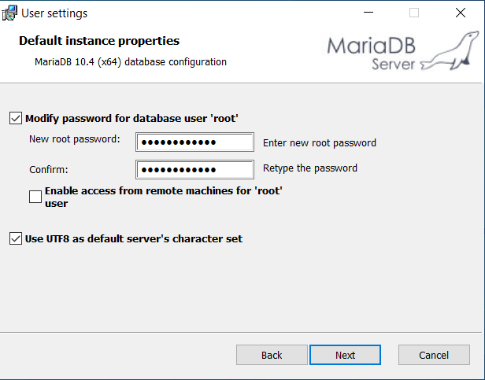
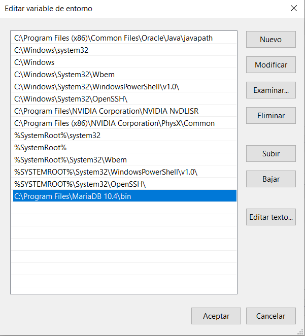
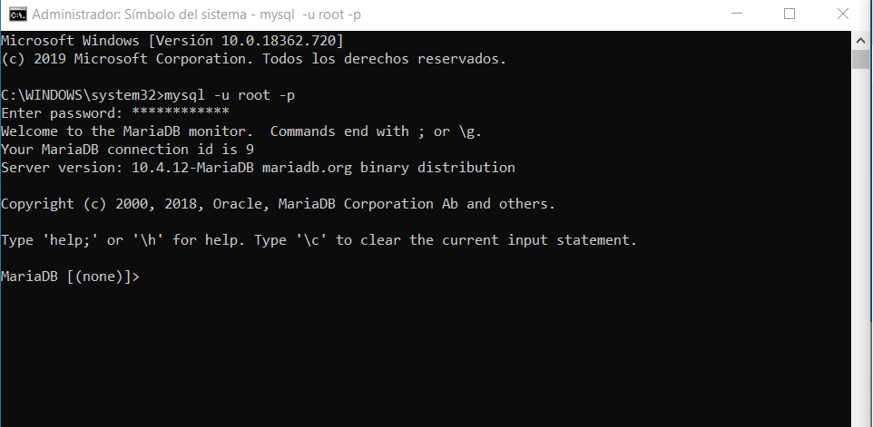
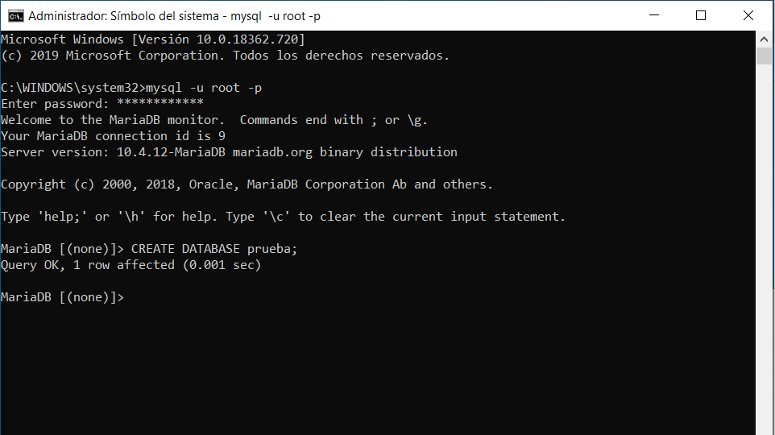
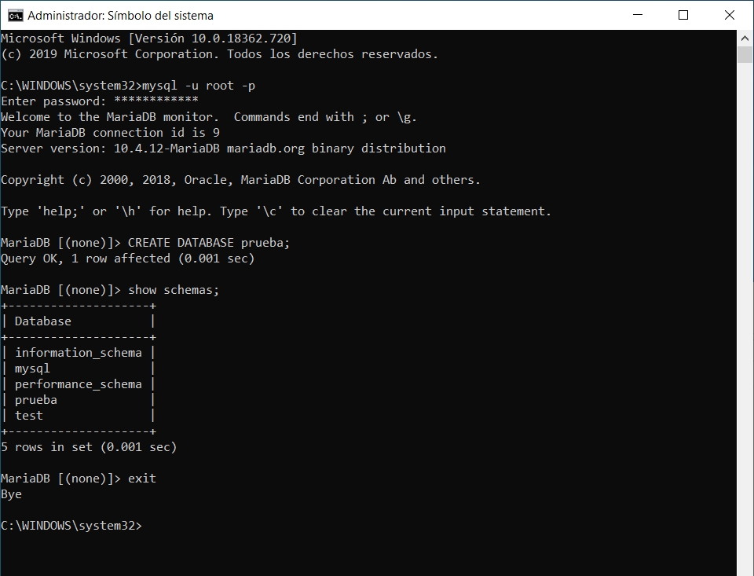

# Instalación de MariaDB en Windows

Después de descargar MariaDB de 64 bits MSI al ejecutarlo comenzará el asistente, en este caso la primera opción la dejaremos por defecto.

En el segundo paso introduciremos la contraseña que utilizara el usuario root, también podemos marcar la opción de utilizar UTF8 como character por defecto.

Este paso lo dejaremos por defecto, podríamos cambiar el nombre del servicio o el puerto si tenemos otros gestores que utilicen el mismo.

Tras la instalación añadimos la ruta de la carpeta bin de MariaDB en la variable path para poder ejecutar MariaDB desde la consola de comandos.

Abrimos el cmd y ejecutamos el comando **mysql -u root -p**, nos pedirán la contraseña que hemos introducido en la instalación.

Ahora creamos una base de datos de prueba

Como vemos en la captura con el comando **show schemas** podemos ver las bases de datos creadas, además de las ya creadas por defecto está la creada en el paso anteriormente llamada "prueba", obviamente esta vacía y es solo para comprobar que el gestor funciona correctamente. Finalmente salimos con el comando exit.