# MariaDB

## Ejercicio 1

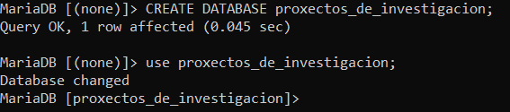

Una vez iniciamos MariaDB el primer paso será crear una base de datos como vemos en la captura, después utilizamos el comando use para modificar la base de datos.

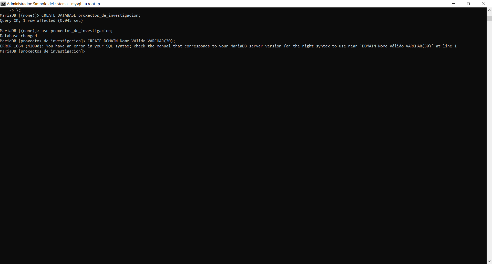

En este caso no podemos crear dominios ya que MariaDB no lo permite

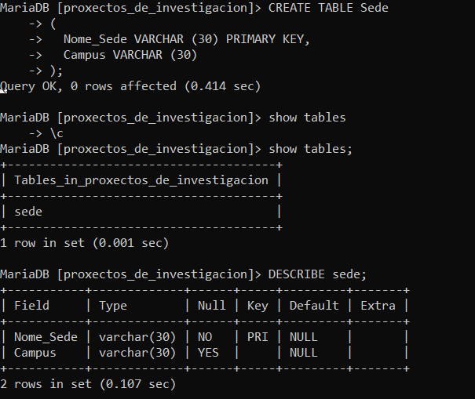

Empezaremos a crear las diferentes tablas con CREATE.
Podemos ver las tablas creadas con **show tables** y la estructura con **DESCRIBE**.

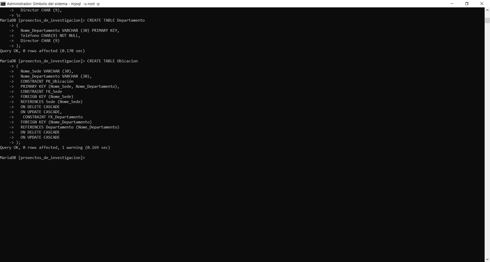

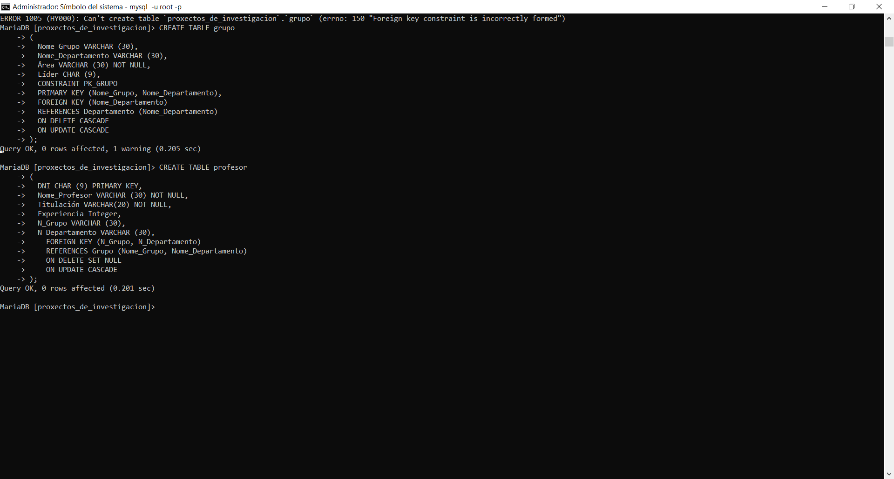

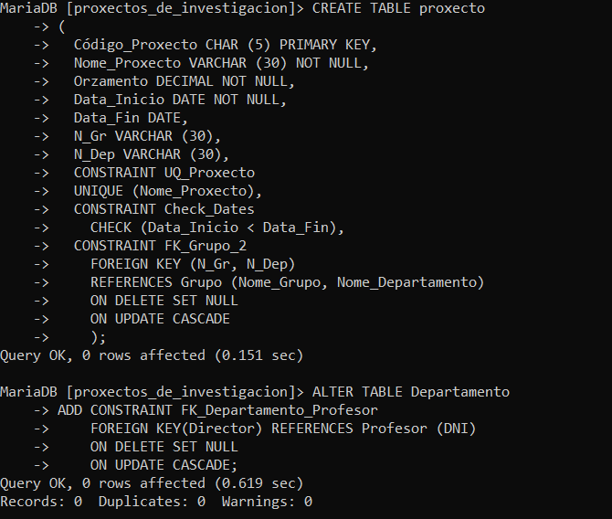

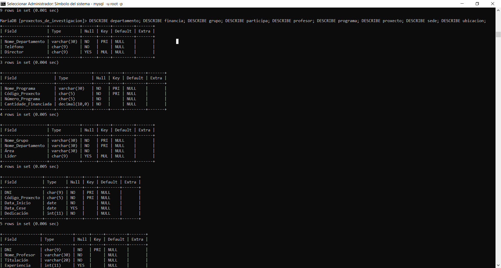

Separando con **;** podemos separar los diferentes **DESCRIBE** para ver la estructura de todas las columnas que enumeremos.

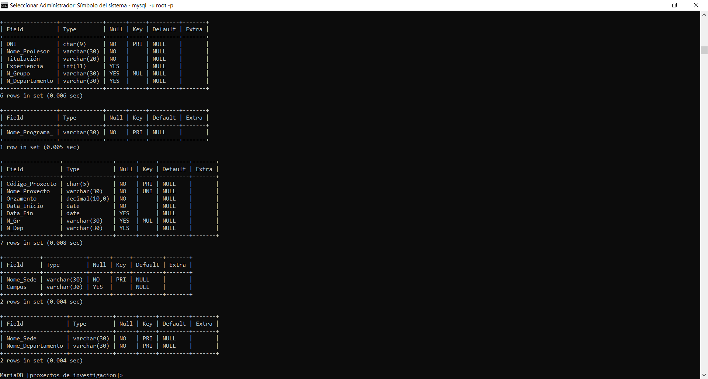

## Ejercicio 2

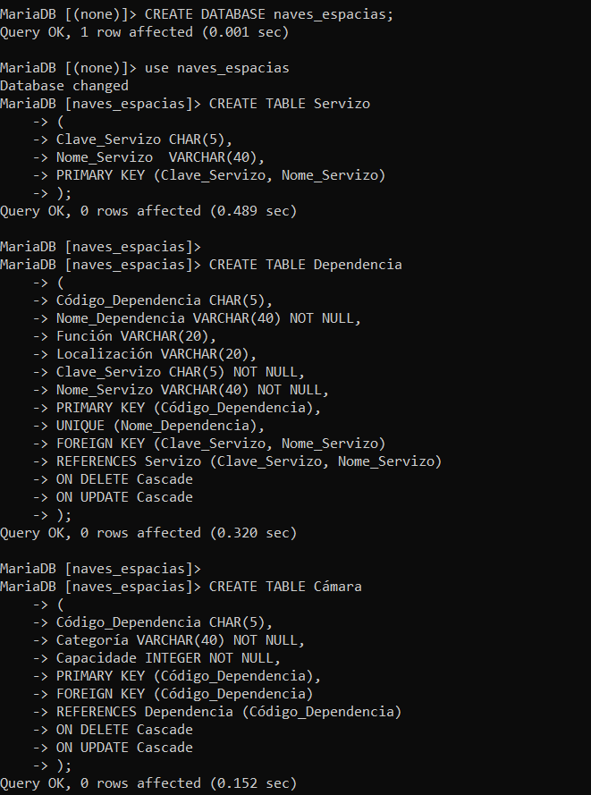

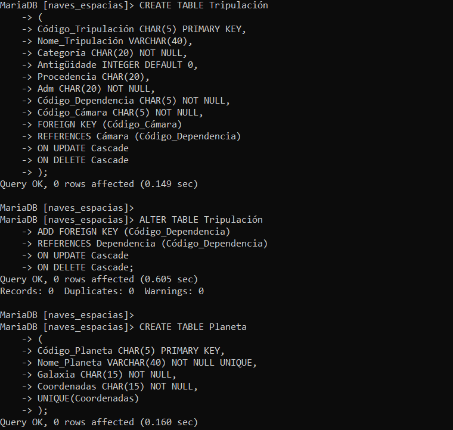

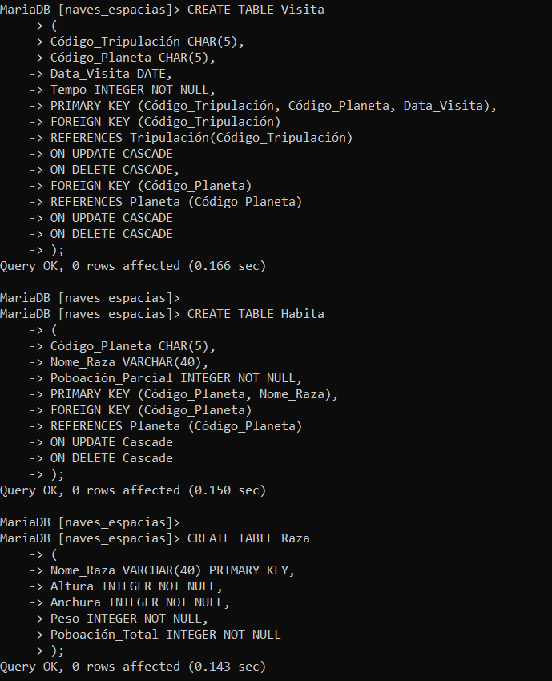

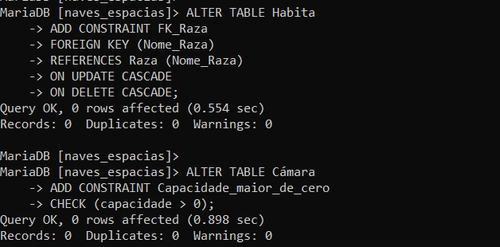

