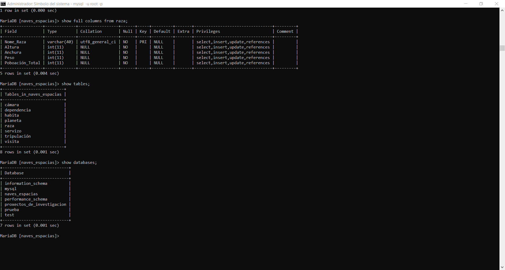
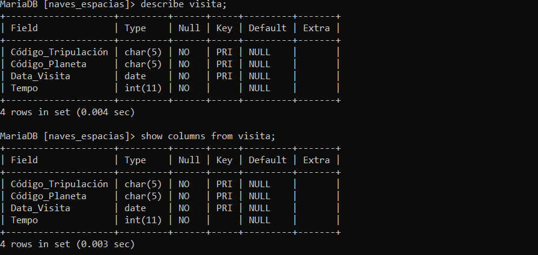
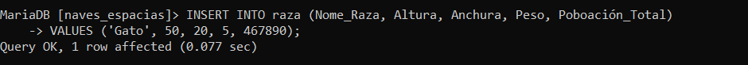
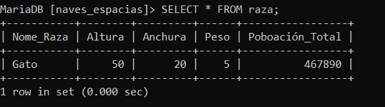

# MariaDB

## Ejercicio 1

Una vez iniciamos MariaDB el primer paso será crear una base de datos como vemos en la captura, después utilizamos el comando use para modificar la base de datos.

En este caso no podemos crear dominios ya que MariaDB no lo permite

Empezaremos a crear las diferentes tablas con CREATE.
Podemos ver las tablas creadas con **show tables** y la estructura con **DESCRIBE**.

Separando con **;** podemos separar los diferentes **DESCRIBE** para ver la estructura de todas las columnas que enumeremos.

## Ejercicio 2

Ahora creamos otra base de datos y sus respectivas tablas.

## Comandos

Los tres comandos básicos para ver la estructura de una base de datos son:

* **SHOW DATABASE**, permite ver las bases de datos.
* **SHOW TABLES**, permite ver las tablas de una base de datos.
* **SHOW COLUMNS**, permite ver la estructura las columnas de una tabla.

###  Ejemplos

En esta imagen podemos ver los tres comandos mencionados anteriormente junto a su sintaxis y resultado obtenido. En este caso con el comando **SHOW COLUMNS** hemos utilizado la opción **full** que muestra a mayores los campos **EXTRA** **PERMISOS** Y **COMENTARIOS**.

Para ver la estructura de una tabla podemos utilizar también **DESCRIBE** sin embargo al utilizar clausulas como el **LIKE** o el **WHERE** para filtrar puede resultar mas sencillo utilizar el comando **SHOW COLUMNS**.

Añadimos datos de prueba a una tabla para consultarlos después.

  

Hacemos un select y podemos comprobar los datos de la tabla.