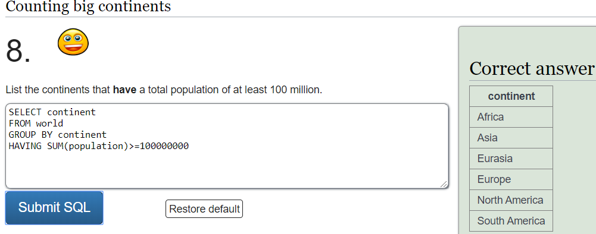
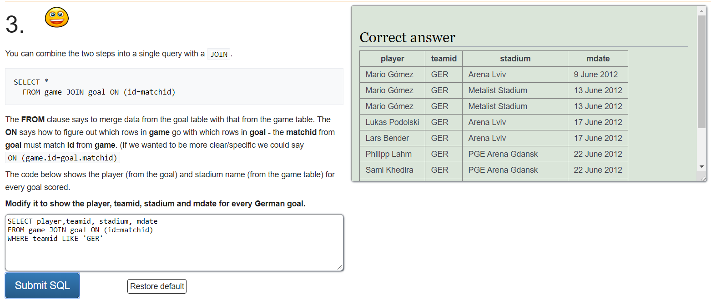
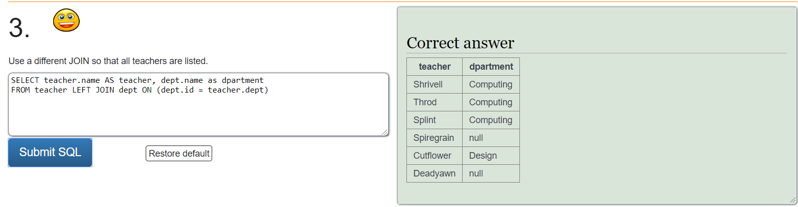
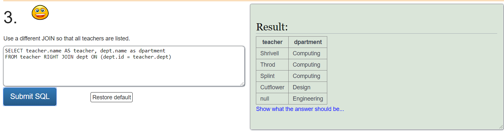
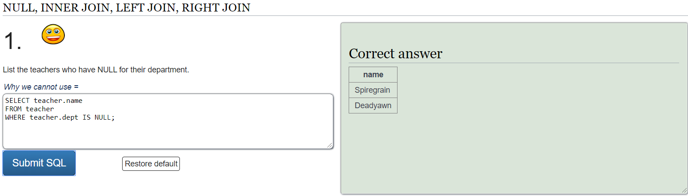
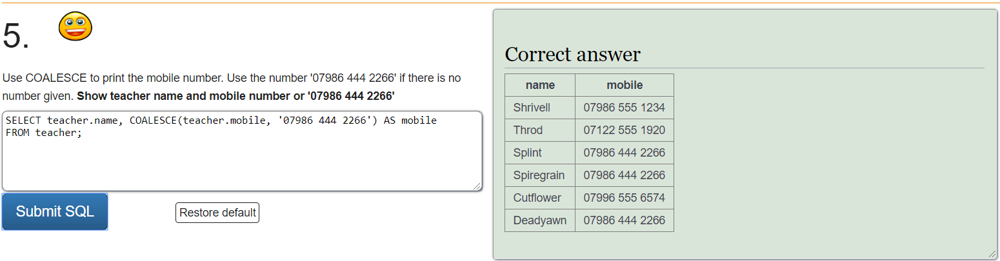
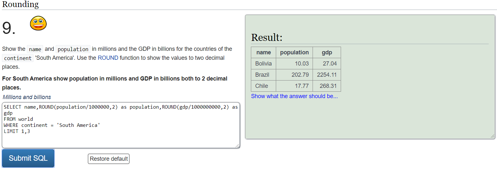

# Apuntes bases de datos

## Sentencias SQL/DQL

### SELECT y FROM

* El **SELECT** nos permite seleccionar las columnas que queremos mostrar en la consulta

EL **\***  nos permite mostrar por pantalla todas las columnas

Con el **AS** cambiamos el nombre de la columna cuando mostramos los datos.

* El **FROM** indica la tabla de la que seleccionamos los datos


```sql
SELECT columna1, columna2,columna3 AS departamento ...
FROM nombre_tabla;
```
### WHERE
* El **WHERE** sirve para filtrar por tuplas. En el escribimos un predicado
```sql
SELECT columna1, columna2,columna3 AS departamento ...
FROM nombre_tabla
WHERE condición;
```
###  OPERADORES AND, OR y NOT
Estos operadores se pueden utilizar por ejemplo en la clausula WHERE.

* El **AND** sirve para filtrar con más de una condición y ambas condiciones situadas entre el AND se deben cumplir.
* El **OR** sirve para filtrar con más de una condición y al menos una de las dos situadas entre el operador se debe cumplir.
* El **NOT** muestra el registro si la condición no es correcta. 

#### Sintaxis AND
```sql
SELECT columna1, columna2,columna3 AS departamento ...
FROM nombre_tabla
WHERE condicion1 AND condicion2 AND condicion3 ...;
```
#### Sintaxis OR
```sql
SELECT columna1, columna2,columna3 AS departamento ...
FROM nombre_tabla
WHERE condicion1 OR condicion2 OR condicion3 ...;
```


#### Sintaxis NOT
```sql
SELECT columna1, columna2,columna3 AS departamento ...
FROM nombre_tabla
WHERE NOT condición;
```

###  IN
* El operador **IN** permite especificar múltiples valores en un predicado.
* El **IN** es equivalente a poner varios valores entre operadores **OR**

#### Sintaxis IN
```sql
SELECT columna1, columna2,columna3 AS departamento ...
FROM nombre_tabla
WHERE nombre_columna 
  IN(valor1,valor2,...);
```
###  BETWEEN
* El operador **BETWEEN** permite especificar rangos de valores (puedes ser números, texto o datos).
* Si le ponemos un **NOT** delante excluiría el rango es decir mostraría todos los valores que no estuvieran dentro del rango del **BETWEEN**
#### Sintaxis BETWEEN
```sql
SELECT columna1, columna2,columna3 AS departamento ...
FROM nombre_tabla
WHERE nombre_columna BETWEEN valor1 AND valor2;
  ```
###  COMPARADORES
| Símbolo | Significado      |
| ------- | :---------------:|
| =       | Igual a          | 
| >       | Mayor que        | 
| <       | Menor que        | 
| >=      | Mayor o igual que|
| <=      | Menor o igual que|
| <>      | No es igual a    |

### COMODINES

| Símbolo | Significado                                                  |
| :-----: | ------------------------------------------------------------ |
| %       | Sustituye 0 o más caracteres                                 | 
| _       | Sustituye un único caracter                                  | 
| []      | Permite sustituir por los caracteres dentro de los corchetes | 
| -       | Permite un rango de caracteres dentro de los corchetes       |
| ^       | Excluye los caracteres dentro de los corchetes               |

###  LIKE
El operador **LIKE** se puede utilizar en la clausula **WHERE** y permite buscar un patrón.
* A diferencia del **=** el cual compara con una cadena exactamente igual, el **LIKE** permite incluir comodines.
    
    Permite los comodines:
    * %
    * _

#### Sintaxis LIKE
```sql
SELECT columna1, columna2,columna3 AS departamento ...
FROM nombre_tabla
WHERE nombre_columna LIKE patron;
  ```
###  ROUND 
Es un operador que permite redondear un valor numérico a la longitud especificada 

#### Sintaxis ROUND
```sql
ROUND ( Expresion_Numerica , Nº_De_redondeo )
```
#### EJEMPLOS
| Ejemplos          |   Resultado    |
| ----------------- | :------------: |
| ROUND(748.58,  1) |   748.6        | 
| ROUND(748.58, -1) |   750          | 

###   LENGHT
Devuelve el numero de caracteres de una cadena

#### Sintaxis LENGHT
```sql
LENGHT(cadena)
```
###   LEFT y RIGHT
Devuelven un número concreto de caracteres de una cadena.
* **LEFT** empieza a contar por la izquierda
* **RIGHT** empieza a contar por la derecha

#### Sintaxis LEFT y RIGHT
```sql
LEFT(cadena)
```

```sql
RIGHT(cadena)
```
###   ORDER BY
Con el **ORDER BY** podemos filtrar por el orden de las tuplas.
* Se puede ordenar por orden ASCENDENTE (**ASC**) o DESCENDENTE (**DESC**)
* Por defecto ordenará por orden ASCENDENTE.

#### Sintaxis ORDER BY
```sql
SELECT columna1, columna2,...
FROM nombre_tabla
ORDER BY columna1, columna2, ... ASC|DESC;
```
###   SUBCONSULTAS O CONSULTAS ANIDADAS
Son consultas completas que podemos poner por ejemplo dentro de una clausula **WHERE** y nos permiten hacer dos tablas independientes y comparar por tanto dos tuplas.

* Las subconsultas son independientes de la consulta por tanto no hace falta poner un alias a las columnas o tablas (Lo que pasa en las Vegas se queda en las Vegas 🎰♠♣♥♦🎰 )

####  EJEMPLO SUBCONSULTAS
```sql
SELECT name 
FROM world
  WHERE population > 
     (SELECT population 
      FROM world
      WHERE name='Russia');
```
* También es muy importante poner la subconsulta después del comparador poque si lo ponemos antes del comparador la consulta no funcionará.
###   CONCAT
Permite la concatenación o combinación de dos o más valores o cadenas.
* Se puede utilizar en el **SELECT** o dentro de un predicado.

#### Sintaxis CONCAT
```sql
CONCAT ( cadena_valor1, cadena_valor2 [, cadena_valorN ] ) ;
```
####  EJEMPLOS CONCAT
```sql
SELECT CONCAT ( 'Feliz ', 'Cumpleaños ', 11, '/', '25' ) AS Result;
```
  El resultado sería una columna con nombre Feliz Cumpleaños 11/25

```sql
SELECT name, CONCAT(ROUND(population/(SELECT population
                               FROM world
                               WHERE name ='Germany')*100,0),'%')
FROM world;
```
  En este caso la consulta concatena el **%** al porcentaje de población de cada país respecto a la población de \"Alemania\".
    Es decir dividimos la población de cada país entre la de alemania y la multiplicamos por 100 para saber el porcentaje, lo ponemos dentro de un **ROUND** para redondear sin decimales y todo el conjunto dentro de un **CONCAT** para añadirle el porcentaje a continuación del resultado.

###   ALL
El operador **ALL** se utiliza en predicados.
* Permite comparar un registro con todos los registros de una subconsulta con un comparador antes del **ALL**

#### Sintaxis ALL
```sql
SELECT nombre_columna(s)
FROM nombre_tabla
WHERE nombre_columna comparador ALL
                                (SELECT nombre_columna
                                FROM nombre_tabla
                                WHERE condición);
```
####  EJEMPLO ALL
```sql
SELECT name
FROM world
WHERE gdp >= ALL(SELECT gdp
                 FROM world
                 WHERE continent = 'Europe' AND gdp > 0)
```

* Es Importante fijarse en la diferencia entre el > y >=, porque debido a esto en las consultas no nos mostraría como resultado el país de **'EUROPE'** con mayor gdp debido a que en este caso Alemania no es mayor que Alemania, por tanto sería necesario el comparador >=.

###   FUNCIONES SUM, COUNT Y AVG
* La función **SUM**  nos devuelve la suma de los valores numéricos de las tuplas de una columna.
* La función **COUNT** nos devuelve una tupla con el número de tuplas que tiene una columna.
* La función **AVG** realiza la media de los valores numéricos de las tuplas de una columna.

#### Sintaxis SUM
```sql
SELECT SUM(columna1)
FROM nombre_tabla
WHERE condición;
```
#### Sintaxis COUNT
```sql
SELECT COUNT(columna1)
FROM nombre_tabla
WHERE condición;
```
#### Sintaxis AVG
```sql
SELECT AVG(columna1)
FROM nombre_tabla
WHERE condición;
```
###   DISTINCT
El distinct permite evitar duplicados, es decir en caso de haber más de un registro con un mismo valor lo devuelve una sola vez

#### Sintaxis DISTINCT
```sql
SELECT DISTINCT columna1, columna2, ...
FROM nombre_tabla;
```
###   GROUP BY
**GROUP BY** permite agrupar por tuplas. Es decir por si hacemos un **GROUP BY** de una columna agrupará en base a cada tupla de esa columna.
* Normalmente el **GROUP BY** se utiliza junto a funciones agregadas (SUM,COUNT,AVG, MIN y MAX) lo cual permite filtrar los resultados de una función agrupados en cada una de las tuplas de la columna sobre la que hacemos el **GROUP BY**.

#### Sintaxis GROUP BY
```sql
SELECT nombre_columna(s)
FROM nombre_tabla
WHERE condición
GROUP BY nombre_columna(s);
```
####  EJEMPLO GROUP BY


###   HAVING
Utilizamos el **HAVING** para hacer predicados con las funciones de agrupamiento, porque no es posible utilizarlas en un **WHERE**.

#### Sintaxis HAVING
```sql
SELECT nombre_columna(s)
FROM nombre_tabla
WHERE condición
GROUP BY nombre_columna(s)
HAVING condición;
```
####  EJEMPLO HAVING


###   INNER JOIN
El **INNER JOIN** (sin el INNER funciona igual) permite utilizar columnas y registros de otras tablas.

#### Sintaxis INNER JOIN
```sql
SELECT nombre_tabla1.columna1, nombre_tabla2.columna1,...
FROM nombre_tabla1 INNER JOIN nombre_tabla2 
ON(nombre_tabla1.nombre_columna = nombre_tabla2.nombre_columna)
WHERE condición;
```
* En el **ON** se pueden incluir predicados, como si fuera en un **WHERE**, por tanto la relación de dos tablas que ponemos en un **ON** también se podría poner en el **WHERE** sin embargo es más cómodo y fácil de entender poniéndolo en el **ON**.
* Se puede hacer un **INNER JOIN** de varias tablas diferentes, incluyendo de esta forma la misma tabla también.
* El **INNER JOIN** elimina nulos.

####  EJEMPLO INNER JOIN


En esta consulta podemos añadir las columnas "stadium" y "mdate" las cuales pertenecen a una tabla diferente (goal) gracias al INNER JOIN.

###   LEFT y RIGHT JOIN
* El **LEFT JOIN** muestra todas las tuplas de la izquierda (es decir de la tabla que hacemos el **FROM**) con todas las tuplas de la tabla que hacemos el **JOIN** aunque estas sean nulas.
*  El **RIGHT JOIN** muestra todas las tuplas de la derecha (es decir de la tabla que hacemos el **JOIN**) con todas las tuplas de la tabla que hacemos el **FROM** aunque estas sean nulas.

#### Sintaxis LEFT Y RIGHT JOIN
```sql
SELECT nombre_tabla1.columna1, nombre_tabla2.columna1,...
FROM nombre_tabla1 RIGHT | LEFT JOIN nombre_tabla2 
ON(nombre_tabla1.nombre_columna = nombre_tabla2.nombre_columna)
WHERE condición;
```
####  EJEMPLO LEFT JOIN


####  EJEMPLO RIGHT JOIN


###   NULL
Es importante saber que un valor **NULL** es un campo que se ha dejado en blanco al crear la tabla (sin valor), es decir no tiene valor 0 ni contiene espacios en blanco.
* Por tanto no se puede comparar un valor nulo con operadores de comparación. (=, <, >, <>, etc)
#### Sintaxis NULL
```sql
SELECT nombre_columna(s)
FROM nombre_tabla
WHERE nombre_columna IS NULL;
```
* También se utiliza el **IS NOT NULL** para filtrar cuando un registro **no** es nulo.

####  EJEMPLO NULL



###   OTRAS FUNCIONES

####  REPLACE
Reemplaza el valor de una cadena especificado por otro valor de cadena.

#####  Sintaxis REPLACE

REPLACE ( cadena , lo que se quiere reemplazar , reemplazo )

####  COALESCE
Evalúa los argumentos en orden y devuelve el primer valor que no sea **NULL**.
#####  Sintaxis COALESCE

COALESCE ( expresión [ ,...n ] )

#####   EJEMPLO COALESCE


Como vemos en la consulta los profesores que tienen no tienen registrado un número de teléfono asignado es decir es **NULL** se les asigna el número que ponemos en el **COALESCE** que podría ser el número del instituto por ejemplo.

####  LIMIT
El **LIMIT** nos permite limitar los campos, de forma que solo nos muestre un número concreto.
* Si ponemos por ejemplo "LIMIT 5,10" saltaría los 5 primeros campos y mostraría solo los 10 siguientes

#####   EJEMPLO LIMIT



###   ORDER DE EJECUCIÓN DE LAS CONSULTAS

1. Primero se ejecuta el **FROM** es decir de que tablas recoge los datos
2. A continuación filtra cada una de las tuplas con el **WHERE**
3. Después se ejecuta el **GROUP BY** en cada una de las tuplas haciendo grupos/subtablas según el criterio especificado.
4. Se ejecuta el **HAVING** por cada grupo/subtabla.
5. Se ejecuta el **SELECT** por cada grupo/subtabla.
6. Finalmente se ejecuta el **ORDER BY** ordenando las tuplas.